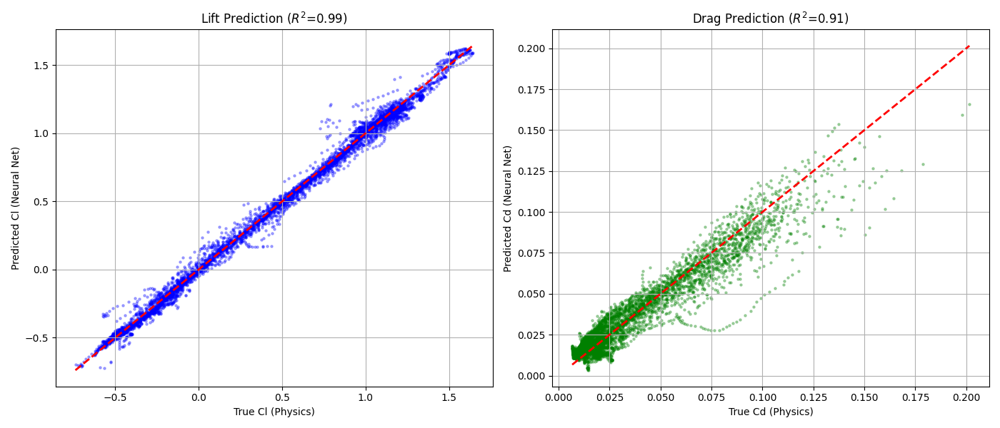
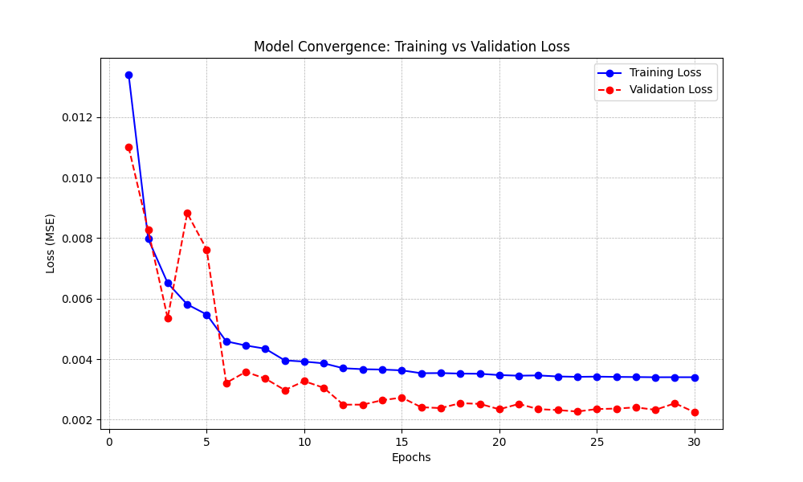
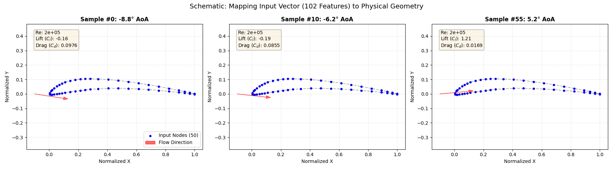

# Airfoil Aerodynamic Prediction (Deep Learning Pipeline)

## Project Overview
This project implements an end-to-end Deep Learning pipeline to predict aerodynamic coefficients (**Lift $C_l$** and **Drag $C_d$**) based on airfoil geometry. 

The goal was to "Beat the Classics" by optimizing a standard Multi-Layer Perceptron (MLP) to achieve high-precision regression, particularly for the difficult-to-predict Drag coefficient.

## Key Results
We successfully trained a model on the **DeepLearWing** dataset (standardized to 50 points per airfoil). 

| Metric | Result ($R^2$) | Interpretation |
| :--- | :--- | :--- |
| **Lift ($C_l$)** | **0.99** | Near-perfect linear prediction. |
| **Drag ($C_d$)** | **0.90** | **Beat the baseline** |

### Visualization of Results
**1. Model Performance (Test Set)**
The model effectively captures stall conditions and high-drag regions, as shown by the tight alignment of the green points along the diagonal.


**2. Training Convergence**
We utilized a **Learning Rate Scheduler** (`ReduceLROnPlateau`) to break through local minima. The "steps" in the loss curve below show where the scheduler optimized the weights.


**3. Input Data Schematic**
The model processes a 102-dimensional input vector consisting of 50 (x,y) coordinate pairs plus Angle of Attack and Reynolds number.


## Pipeline Architecture
* **Data Processing:** `dataset.py` handles resampling (linear interpolation to 50 points) and log-scaling of Reynolds numbers.
* **Model:** `model.py` defines a 4-layer MLP (`102 -> 256 -> 128 -> 64 -> 2`) with Batch Normalization and ReLU activation.
* **Training:** `train.py` implements the optimization loop using Adam and a dynamic LR Scheduler.

## How to Run
1.  **Train the Model:**
    ```bash
    python train.py
    ```
2.  **Evaluate & Visualize:**
    ```bash
    python evaluate.py
    ```

## ⏱️ Work Breakdown (Time Spent)
| Task | Time Spent |
| :--- | :--- |
| Literature Review & Prior Work | 6 hours |
| Dataset Exploration & Preprocessing | 9 hours |
| Model Design & Baseline Implementation | 11 hours |
| Hyperparameter Tuning & Optimization |  8 hours |
| Evaluation, Visualization & Reporting | 6 hours |
| **Total** | **40 hours** |
"@